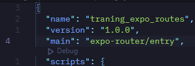
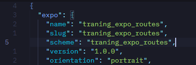
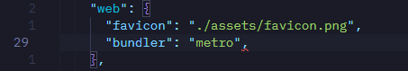
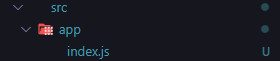
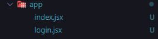
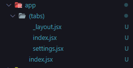

# como_usar_expo_routes_para_criacao_de_apps

apenas um repostorio para a explicacao de como funciona do expo routes e como lidar com ele de forma dinamica

---

## Index

```txt
3. UTILIZACAO DE EXPO ROUTES
    3.1 Instalacao Expo
    3.2 Estrutura de Pastas
    3.3 Utilizacao do Expo Routes
```

---

## 3. UTILIZACAO DE EXPO ROUTES

Oq eh o expo routes?

eh um facilitador para a criacao de rotas (varias telas) dentro da sua aplicacao, diretamente pelo expo, e nativamente no dispositivo que esteja rodando

> para iniciarmos crie um brank project e vamos baixar algumas dependencias dentro dele (seria possivel criar um projeto ja com as rotas configuradas, entretanto, prefiro comecar do 0), seguindo, eh claro, a [documentacao oficial](https://docs.expo.dev/router/installation/#quick-start) :P

---

### 3.1 Instalacao Expo

1. de inicio apenas rode o comando:

```sh
npx expo install expo-router react-native-safe-area-context react-native-screens expo-linking expo-constants expo-status-bar && npx expo install react-native-web react-dom
```

---

2. agora dentro do `package.json` na linha `4` cole a seguinte linha de codigo:

*./package.json*

```js
//... resto do codigo
"main": "expo-router/entry"
//... resto do codigo
```

Seu codigo ficara assim:



---

3. dentro do `app.json` voce ira adicoinar esse codigo (LEVANDO EM CONTA QUE ONDE TEM ESCRITO *your-app-scheme* voce ira adicionar o mesmo nome dos paths adicionados acima!!):

*./app.json*

```js
//... resto do codigo
"scheme": "your-app-scheme"
//... resto do codigo
```

vai ficar assim:



**observe que o parametro do *scheme* eh o mesmo do *name* e do *slug* ent faca o mesmo no seu projeto!!**

---

4. na linha `29` do `app.json` adioine a seguinte linha de codigo:

*./app.json*

```js
//resto do codigo
"bundler": "metro"
//resto do codigo
```

vai ficar assim:



---

5. por fim, rode sua aplicacao com o comando:

```sh
npx expo start -c
```

### 3.2 Estrutura de Pastas

a estruturacao de pastas agora sera um pouco diferente da que estavamos acostumados, lembrando mais uma estruturacao para a web, dq uma que ja vimos previamente, para isso criaremos uma pasta dentro do `./src/` chamada `app/`, entao vamos comecar!!

---

1. crie a pasta no diretorio `./src/` chamada `app/`, e um arquivo `index.jsx` dentro dessa pasta, ficara assim:



ok, daqui de cima eh soh ladeira a baixo :P

---

2. cole o seguinte codigo dentro do `index.jsx`:


```jsx
import { StyleSheet, Text, View } from "react-native";
import { Link } from 'expo-router'

export default Page = () => {
  return (
    <View style={styles.container}>
      <Text style={styles.title}>MAIN SCREEN</Text>

      
        <Link style={styles.buttonContainer} href='login'>
          Go to LOGIN PAGE
        </Link>
      
    </View>
  )
}

const styles = StyleSheet.create({
  container: {
    flex: 1,
    alignItems: "center",
    justifyContent: "center",
  },
  title: {
    fontSize: 64,
    fontWeight: "bold",
  },
  buttonContainer: {
    backgroundColor: "#BEFFF7",
    padding: 20,
    width: 300,
  }
});

```

considere que a estilizacao foi feita apenas para nao ficar TAO FEIO, relevemos...

agora observe na linha `2` uma lib diferente foi importada, chamada `expo-router` ela eh a lib que facilita nossa vida :P

na linha `9` chamamos o componente que foi importado na linha `2` o `Link`, se voce ja codou em HTML, lembre da tag `a` funciona do mesmo jeito.

**quando se esta usando o expo router, todas as telas que adicoinar no diretorio `app` serao considerados telas, e a navegacao sera feita por elas**

---

3. ainda nao esta navegando para lugar algum, entao vamos criar a pagina que o link esta nos levando:

adicione um arquivo chamado `login.jsx` no diretorio `app/`:



agora adicione esse codigo:

```js
import { StyleSheet, Text, View, Button } from "react-native";
import { Link } from "expo-router";

export default Page = () => {
  return (
    <View style={styles.container}>
      <Text style={styles.title}>LOGIN</Text>

        <Link style={styles.buttonContainer} href=''>
            Go to LOGIN PAGE
        </Link>
    </View>
  )
}

const styles = StyleSheet.create({
  container: {
    flex: 1,
    alignItems: "center",
    justifyContent: "center",
  },
  title: {
    fontSize: 64,
    fontWeight: "bold",
  },
  buttonContainer: {
    backgroundColor: "#BEFFF7",
    padding: 20,
    width: 300,
  }
});

```

*observe que para retornar para o index nem um *path* foi adiocinado no href!!*

---

4. ok, agora e se eu quiser utilizar uma barra de navegacao? como faria ela?

com o expo router eh facil, adicione uma pasta chamada `(tabs)/`, *estranho? eh eu sei*, dentro do `app/` e adicione alguns arquivos :



(observe que o index esta fora da pasta `(tabs)/`)

**vamos alterar o codigo de alguns arquivos, entao fique atento para o path indicado acima do codigo:**

*(tabs)/_layout.jsx*

```jsx
import { Tabs } from "expo-router";
import { MaterialIcons } from '@expo/vector-icons'

export default function TabRoutesLayout() {
  return (
    <Tabs screenOptions={{headerShown: false}}>
      <Tabs.Screen
        name="index"
        options={{
          title: "Profile",
          tabBarIcon: ({ size, color }) => 
            <MaterialIcons name="person" color={color} size={size}/>
        }}
      />

      <Tabs.Screen
        name="settings"
        options={{
          title: "Settings",
          tabBarIcon: ({ size, color }) => 
            <MaterialIcons name="settings" color={color} size={size}/>
        }}
      />


    </Tabs>
  )
}
```

> dentro da pasta `(tabs)` ja separa o tipo de navegacao, as configuracoes sao mostradas como o codigo acima, como icones, cores, e nomes das paginas, etc. As configuracoes sao multiplas (nao soh para as paginas com barra de navegacao, mas para a com navegacao em *stack* tabem, navegacao por stack eh a padrao)

*index.jsx*

```jsx
import { StyleSheet, Text, View } from "react-native";
import { Link } from 'expo-router'

export default index = () => {
  return (
    <View style={styles.container}>
      <Text style={styles.title}>LOGIN PAAAAGEEE</Text>

        <Link style={styles.buttonContainer} href='/(tabs)/'>
          LOGIN ON THE APP
        </Link>
      
    </View>
  )
}

const styles = StyleSheet.create({
  container: {
    flex: 1,
    alignItems: "center",
    justifyContent: "center",
  },
  title: {
    fontSize: 64,
    fontWeight: "bold",
  },
  buttonContainer: {
    backgroundColor: "#BEFFF7",
    padding: 20,
    width: 300,
  }
});
```

> agora o `href` esta redirencionando para dentro da pasta de *tabs* ou seja, da navegacao por barra

*(tabs)/settings.jsx*

```jsx
import { StyleSheet, Text, View, Button } from "react-native";
import { Link } from "expo-router";

export default Page = () => {
  return (
    <View style={styles.container}>
      <Text style={styles.title}>Settings screen</Text>

        <Link style={styles.buttonContainer} href=''>
            Go to LOGIN PAGE
        </Link>
    </View>
  )
}

const styles = StyleSheet.create({
  container: {
    flex: 1,
    alignItems: "center",
    justifyContent: "center",
  },
  title: {
    fontSize: 64,
    fontWeight: "bold",
  },
  buttonContainer: {
    backgroundColor: "#BEFFF7",
    padding: 20,
    width: 300,
  }
});
```

*(tabs)/settings.jsx*

```jsx
import { StyleSheet, Text, View, Button } from "react-native";
import { Link } from "expo-router";

export default Page = () => {
  return (
    <View style={styles.container}>
      <Text style={styles.title}>Home screen!!</Text>

        <Link style={styles.buttonContainer} href=''>
            Go to LOGIN PAGE
        </Link>
    </View>
  )
}

const styles = StyleSheet.create({
  container: {
    flex: 1,
    alignItems: "center",
    justifyContent: "center",
  },
  title: {
    fontSize: 64,
    fontWeight: "bold",
  },
  buttonContainer: {
    backgroundColor: "#BEFFF7",
    padding: 20,
    width: 300,
  }
});
```

> os ultimos dois blocos de codigo sao apenas para exemplificao, nada do que ja nao tivesesmos visto